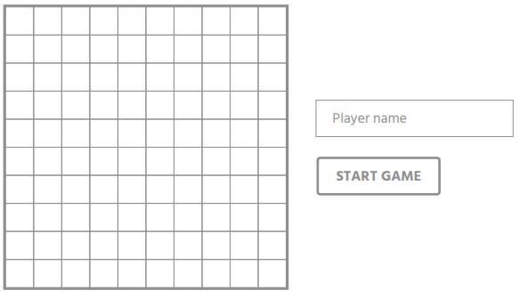
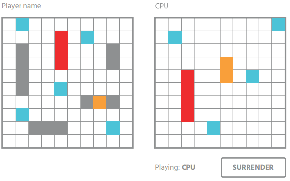
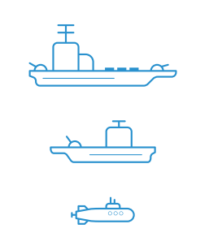

# REACT DEVELOPMENT TEST

## Battleship game

### MAIN GOAL
Develop a simplified React version of the battleship game; player vs CPU.

### GAME ELEMENTS AND CHARACTERISTICS
- 10x10 board size
- 1 carrier of 4 spaces
- 3 cruisers of 3 spaces
- 1 submarine of 2 spaces
- Ships must be straight lines
- Ships can be placed horizontally or vertically


### BASIC GAMEPLAY
The game should have at least **3 screens** with the following components and actions.
<br/>All mockups are just for reference and can be improved.

#### START SCREEN
- Place your ships on the board
- Enter player name
- Button with “Start game” label

<center>



</center>

#### GAME SCREEN
- Player and CPU boards
- Game state ("Playing: Player name or CPU")
- Clicking on computer board, you launch your missiles
- Launched missiles reference<br>HIT -orange-, DESTROYED -red-, MISSED/WATER -light blue-
- Attempt feedback (ship hit, ship destroyed, shot missed)
- CPU missiles can't be launched in random way (once the CPU hits a ship, the next shots must follow some strategy in order to sink the ship)
- Surrender button to end the game manually

<center>



</center>

#### END GAME SCREEN
- Game result: won, lost, surrendered
- Restart button to go back to the Start screen

<center>

```html
For more info about the game, check the Wikipedia article.
https://en.wikipedia.org/wiki/Battleship_(game)
```

</center>

### REQUIREMENTS
- You need to create a **GitHub repository** and send us the link so we can see the progress
- Please, try to **commit often and use clear and concise commit messages**
- The project must be **bootstrapped with Create React App** (<span>https</span>://github.com/facebook/create-react-app)
- Use **React Hooks** and avoid to use Classes
- You must use **Redux** to manage the application state
- Use **React Testing Library** to test the application
- Each component must have its **own test file**
- Tests all the features that you **consider to be relevant**
- Include **Snapshots Testing**
- Try to reach a **good percentage of coverage**
- Include **ESLint using Airbnb's ESLint Rules** (eslint-config-airbnb)
- Keep the use of **third-party packages to a minimum**
- Try to use the **latest versions of the packages** that are included
- **Add documentation**, highlight on complex logics
- Should work in the **latest versions of all major browsers** (Edge, Chrome, Firefox, Safari), both **desktop and mobile**
- Code and comments must be in **English**
- Keep in mind that we are going to analyze the code, look at **good practices, variable names, structures and so on, good luck!**

(_[PDF challenge file](Battleship-FrontendReact(5).pdf) by [Arzion](https://www.arzion.com/)_)

<center>



</center>

---

### My Notes

#### Researched sites
- Markdown
    - [Mastering Markdown](https://guides.github.com/features/mastering-markdown)
    - [Markdown: Syntax](https://daringfireball.net/projects/markdown/syntax#html)
    - [Creating and highlighting code blocks](https://docs.github.com/en/github/writing-on-github/creating-and-highlighting-code-blocks)
    - [How do I prevent auto-generated links in the GitHub wiki?](https://stackoverflow.com/questions/25706012/how-do-i-prevent-auto-generated-links-in-the-github-wiki)
- Battleship Game
    - [Battleship (game)](https://en.wikipedia.org/wiki/Battleship_(game))
    - [Batalla naval (juego)](https://es.wikipedia.org/wiki/Batalla_naval_(juego))